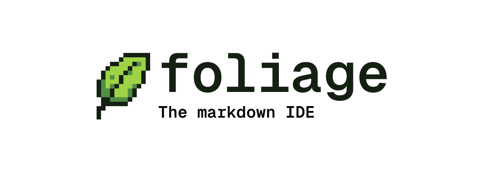

# Foliage



Foliage is a local-first writing workspace for markdown projects. It gives you a file tree, a multi-pane Monaco editor, PDF and image viewing, collaboration over WebSockets, and export tools powered by [Leafmark](https://github.com/DDDASHXD/leafmark).

## What Foliage Is

Foliage is built for long-form markdown work that still needs a real project workspace around it: notes, books, reports, papers, documentation, and mixed markdown/code folders.

It is not a hosted editor. Your files live on disk in a normal folder. Foliage starts a local server for that folder, exposes a browser or desktop UI, and writes changes back to the filesystem. That local server also handles collaboration, workspace file operations, and Leafmark builds.

## What You Can Do

- Open or create a folder-based writing project
- Browse, create, rename, move, and delete files and folders
- Edit text and markdown
- Split editor panes by dragging tabs to pane edges
- Preview PDFs and images alongside source files
- Collaborate with other clients through Yjs and WebSockets
- Build Leafmark projects to PDF, DOCX, and HTML (more to come)
- Share a local workspace through a relay when live share is enabled
- Run as a desktop app, a CLI-launched web app, or a headless server

## Install

### Desktop App

Download a desktop build from [GitHub Releases](https://github.com/DDDASHXD/foliage/releases).

| Platform            | Asset                     |
| ------------------- | ------------------------- |
| macOS Apple Silicon | `foliage_*_aarch64.dmg`   |
| macOS Intel         | `foliage_*_x64.dmg`       |
| Windows             | `foliage_*_x64-setup.exe` |
| Linux               | `.deb` or `.AppImage`     |

On macOS, current release builds are ad-hoc signed rather than notarized. If macOS blocks the app after installation, remove the quarantine attribute:

```bash
xattr -cr /Applications/foliage.app
```

You can also right-click `foliage.app`, choose **Open**, then confirm.

### CLI

Run Foliage without cloning the repo:

```bash
pnpx foliage
```

Open a specific workspace:

```bash
pnpx foliage --workspace /path/to/project
```

The CLI starts the Foliage server and UI locally. By default it serves the launcher on port 3000.

## Creating A Project

1. Start the desktop app or run `pnpx foliage`.
2. Choose **Create project** in the launcher.
3. Pick a parent folder and project name.
4. Open the generated `project/chapter-1.md`.
5. Write markdown as normal.
6. Open **Export**.
7. Build the project with the default PDF settings.

The generated project is just a folder on disk. You can edit it from Foliage, your terminal, Git, or any other editor.

## Using An Existing Markdown Folder

1. Start Foliage.
2. Choose **Open folder**.
3. Select the folder containing your markdown files.
4. Open **Export**.
5. Select the folder that should become the Leafmark project.
6. Click **Initialize project** if the folder does not already contain Leafmark config.
7. Arrange chapters in the **Chapters** tab.
8. Build to PDF, DOCX, or HTML.

Foliage keeps workspace settings in `.foliage/settings.json`. Leafmark-specific project files stay with the selected Leafmark project folder.

## Build From Source

Prerequisites:

- Node.js 20 or newer
- pnpm 9.15.9 or compatible through Corepack
- Rust 1.88 or newer through rustup, only for desktop builds

Clone and install:

```bash
git clone https://github.com/DDDASHXD/foliage.git
cd foliage
pnpm install
```

Run the web app and local server:

```bash
pnpm dev
```

Run the desktop app in development:

```bash
pnpm --filter desktop setup:rust
pnpm desktop:dev
```

Build everything:

```bash
pnpm build
```

Build the desktop app:

```bash
pnpm desktop:build
```

Desktop build output is written under `apps/desktop/src-tauri/target/release/bundle/`.

## Running A Headless Workspace Server

Foliage can run without serving the full UI. This is useful for a LAN or VPS workspace that desktop or web clients connect to.

```bash
foliage-server \
  --headless \
  --workspace /path/to/project \
  --port 8787 \
  --hostname 0.0.0.0
```

Check that it is running:

```bash
curl http://127.0.0.1:8787/api/health
```

Then use **Connect to server** in the launcher and enter the server URL.

## Live Share

Live share tunnels a local Foliage workspace through a relay, so another client can connect without direct port forwarding.

The default relay URL is:

```text
https://foliage.skxv.dev
```

You can also self-host the relay:

```bash
pnpm --filter @foliage/relay dev
```

or:

```bash
foliage-relay --port 8788 --public-base https://relay.example.com
```

See `packages/foliage-relay/README.md` for relay details.

## How It Fits Together

```text
Desktop app or browser UI
        |
        v
@foliage/server
  - workspace filesystem API
  - Yjs collaboration WebSocket
  - Leafmark build API
  - optional Next.js UI hosting
        |
        +--> local filesystem
        +--> Leafmark PDF/DOCX/HTML outputs
        +--> collaborators
        +--> optional live share relay
```

| Entry point                 | What it runs                                        |
| --------------------------- | --------------------------------------------------- |
| `pnpx foliage`              | Local Foliage server plus web UI                    |
| Desktop app                 | Tauri shell plus embedded Foliage server            |
| `foliage-server --headless` | Workspace API, collaboration, and Leafmark API only |
| `foliage-relay`             | Public relay for live share                         |

## Repository Layout

| Path                       | Role                                                                             |
| -------------------------- | -------------------------------------------------------------------------------- |
| `apps/web/`                | Next.js UI for launcher, editor, Leafmark dialogs, and workspace views           |
| `apps/desktop/`            | Tauri desktop shell and native integrations                                      |
| `packages/foliage-server/` | Runtime server for filesystem access, collaboration, Leafmark, and headless mode |
| `packages/foliage-relay/`  | Relay server and relay client for live share                                     |
| `packages/ui/`             | Shared UI components                                                             |
| `bin/foliage.mjs`          | CLI entry for `pnpx foliage`                                                     |

## Useful Commands

| Command                | Description                                 |
| ---------------------- | ------------------------------------------- |
| `pnpm dev`             | Run development tasks through Turborepo     |
| `pnpm build`           | Build all packages                          |
| `pnpm typecheck`       | Type-check all workspaces                   |
| `pnpm lint`            | Lint all workspaces                         |
| `pnpm format`          | Format through Turborepo                    |
| `pnpm desktop:dev`     | Run the Tauri desktop app in development    |
| `pnpm desktop:build`   | Build desktop release bundles locally       |
| `pnpm server:headless` | Start a sample headless server on port 8787 |

## More Documentation

- `packages/foliage-server/README.md` - server modes, health checks, and deployment notes
- `packages/foliage-relay/README.md` - live share relay API and self-hosting
- `apps/desktop/README.md` - desktop development and Tauri notes
- `AGENTS.md` - contributor architecture notes
